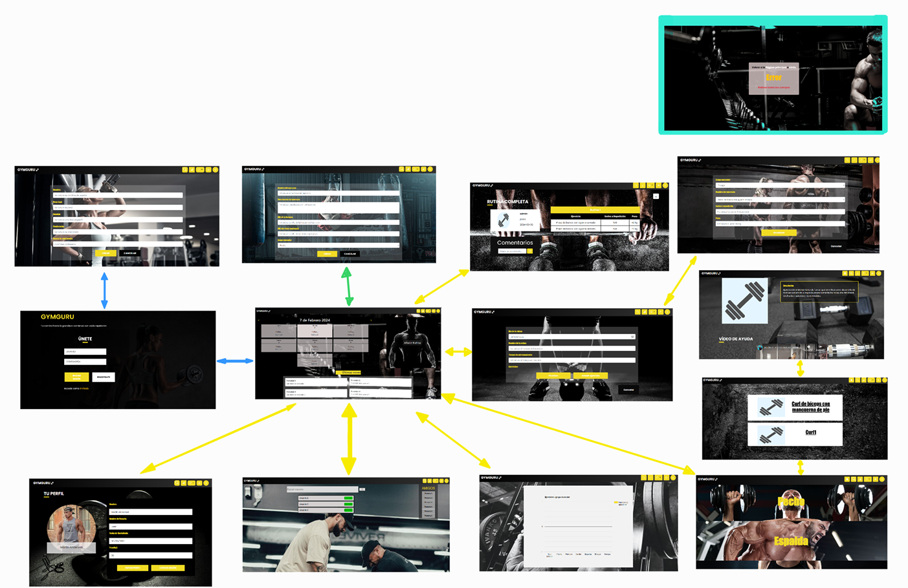
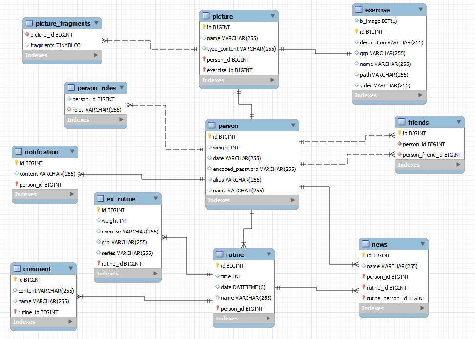
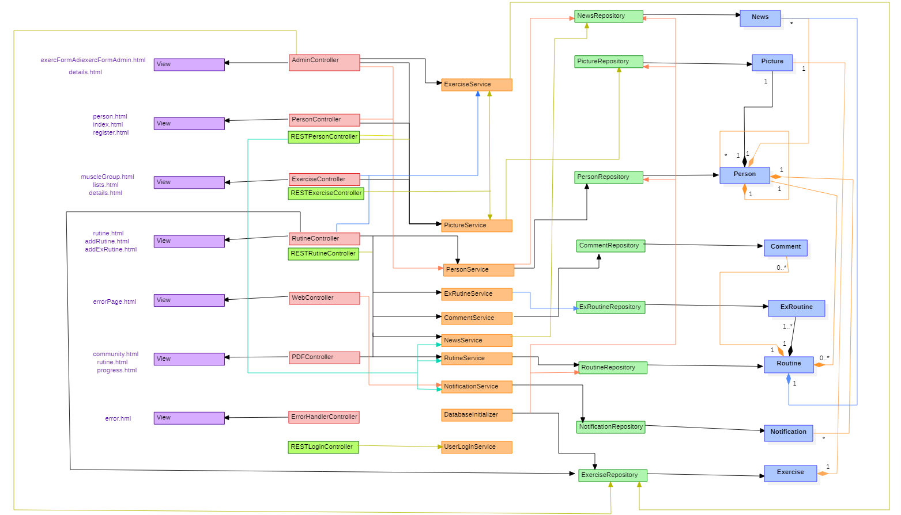
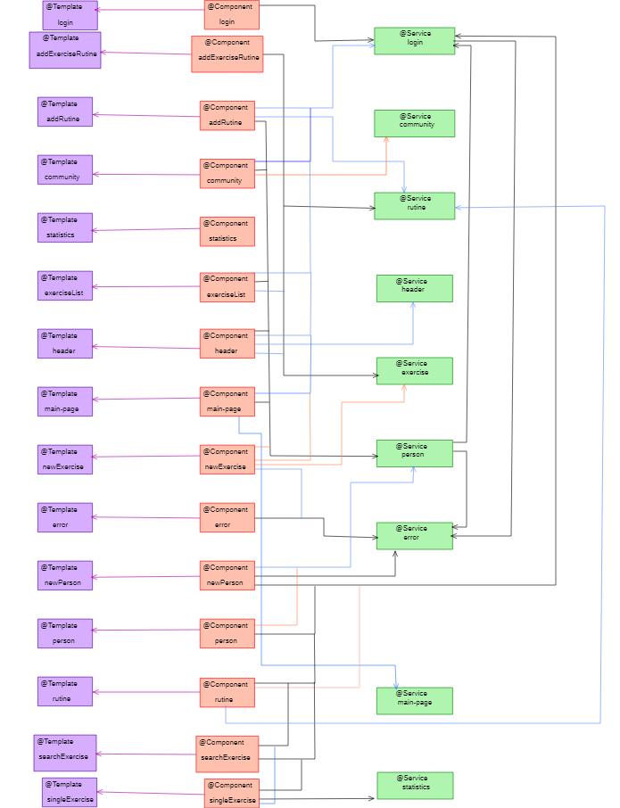

# Nombre de la aplicación: GymGuru 🏋️

## Video explicativo de la aplicación
Acceder al [enlace](https://www.youtube.com/watch?v=ixs79PK5sfI)

## Integrantes: 
| Name | Email | Github |
|-----------|-----------|-----------|
| Rubén Rodríguez Redondo    | r.redondo.2020@alumnos.urjc.es |[Ruben-Rodriguez-Redondo](https://github.com/Ruben-Rodriguez-Redondo) |             |
| Victoria Orzáez de la Cruz | v.orzaez.2020@alumnos.urjc.es | [v-orzaez](https://github.com/v-orzaez)                             |
| Noelia Berzosa Parra       | n.berzosa.2020@alumnos.urjc.es | [noeliaberzosa](https://github.com/noeliaberzosa)                   

## Herramienta de coordinación del equipo: 
[Tablero de GitHub](https://github.com/users/Ruben-Rodriguez-Redondo/projects/2)

## Aspectos principales:
- **Entidades:** usuario, rutina, ejercicio, comentario.
  - Un usuario entrena un día haciendo una serie de ejercicios y los demás usuarios pueden comentar sobre su día.

   

- **Permisos de usuario:**
  - Usuario registrado: añadir su rutina, comentar, acceder ejercicios, ver progreso.
  - Usuario no registrado: acceder ejercicios y ver comentarios.
  - Administrador: añadir/borrar/editar ejercicios, usuarios y comentarios.
- **Imágenes:** de ejercicios y de usuario.
- **Gráficos:** de progreso y de ejercicios específicos.
- **Tecnología complementaria:** descargar tu rutina en PDF.
- **Algoritmo o consulta avanzada:** en base a rutinas pasadas que se den consejos de ejercicios o de la propia rutina.

## Capturas de pantalla: 

- **Página de Inicio:**
 

**Descripción**: Es una pantalla de presentación. En esta página un usuario decide registrarse en la aplicación, iniciar sesión o entrar como invitado. 

- **Pantalla registro de usuarios:**

 

**Descripción**:En la barra superior de izquierda a derecha se encuentran los botones para: buscar ejercicio, página de estadísticas, notificaciones, comunidad y perfil de usuario. Esta pantalla sirve para que un usuario se de de alta en la aplicación.


- **Página Principal:** 

 

**Descripción**: En la barra superior de izquierda a derecha se encuentran los botones para: buscar ejercicio, página de estadísticas, notificaciones, comunidad y perfil de usuario.

Debajo se encuentran un calendario con los últimos 7 días en los que puedes ver las rutinas que has subido. A su derecha se encuentra un botón para añadir rutina.

Por último aparece una sección de novedades relacionadas con rutinas que han subido otras personas, nuevos ejercicios añadidos, etc.

- **Página de tu Perfil:**

 

**Descripción**: En la barra superior de izquierda a derecha se encuentran los botones para: buscar ejercicio, página de estadísticas, notificaciones, comunidad y perfil de usuario.
Posteriormente, se encuentra la foto de perfil del usuario y su información personal guardada, en dicha página el usuario tiene la opción de modificar la información y de cerrar la sesión.

- **Página de tu Comunidad:**

 

**Descripción**: Barra superior similar a la Página Principal, un buscador para buscar usuarios a los que se podrá enviar una solicitud de amistad y en la zona derecha aparecerá tu lista de amigos.


- **Página Progreso usuario:**

 

**Descripción**:En la barra superior de izquierda a derecha se encuentran los botones para: buscar ejercicio, página de estadísticas, notificaciones, comunidad y perfil de usuario.  Esta pantalla sirve para que el usuario vea su progreso; así como sus rutinas.

- **Página de Rutina:**

 

**Descripción**: En la barra superior de izquierda a derecha se encuentran los botones para: buscar ejercicio, página de estadísticas, notificaciones, comunidad y perfil de usuario.
Posteriormente, se encuentra los del usuario que ha subido la rutina, así como una tabla donde se muestra toda la información relativa a la rutina, los ejercicios, el número de series por repetición y el peso.
Por último, se pueden observar los comentarios que otros usuarios han publicado sobre la rutina y la posibilidad de comentar.

- **Añadir Rutina:**

 

**Descripción**:En la barra superior de izquierda a derecha se encuentran los botones para: buscar ejercicio, página de estadísticas, notificaciones, comunidad y perfil de usuario. Esta pantalla sirve para que un usuario pueda guardar una nueva rutina.

- **Añadir ejercicio a la rutina:**

 

**Descripción**:En la barra superior de izquierda a derecha se encuentran los botones para: buscar ejercicio, página de estadísticas, notificaciones, comunidad y perfil de usuario. Esta pantalla sirve para que un usuario pueda añadir un ejercicio a su rutina.

- **Página de Grupo Muscular:**

 

**Descripción**:En la barra superior de izquierda a derecha se encuentran los botones para: buscar ejercicio, página de estadísticas, notificaciones, comunidad y perfil de usuario. Es la página previa a la lista de ejercicios almacenados por grupo muscular. En esta pantalla el usuario filtra por grupo muscular.

- **Lista de ejercicios de un grupo muscular:**

 

**Descripción**:Una lista de los ejercicios asociados a un grupo muscular.


- **Página Detalle ejercicio:**

 

**Descripción**:En la barra superior de izquierda a derecha se encuentran los botones para: buscar ejercicio, página de estadísticas, notificaciones, comunidad y perfil de usuario. En esta pantalla se especifica el ejercicio.
- **Página Formulario nuevo ejercicio del Administrador:**

 

**Descripción**:En la barra superior de izquierda a derecha se encuentran los botones para: buscar ejercicio, página de estadísticas, notificaciones, comunidad y perfil de usuario. Esta pantalla únicamente es accesible por el administrado; y será utilizada cuando quiera incluir un nuevo ejercicio en la base de datos.

- **Página Error:**

 


## Diagrama de navegación: 
- **<span style="color:blue">Azul</span>:** Todos los usuarios.
- **<span style="color:yellow">Amarillo</span>:** Usuarios Registrados y administrador.
- **<span style="color:green">Verde</span>:** Administrador.
- **Nota**: desde cualquier página puedes llegar a la página de error
 

## Diagrama con las entidades de la base de datos: 
 

## Diagrama de clases y templates: 
 


## Participación
- **<span style="color:green">Victoria Orzáez </span>:** 
    - Tareas: mostrar, editar perfil de usuario, puerto 8443, implementar la seguridad, el uso de token, invitado, loging y logout, ver rutina y comentarios, crear rutina, añadir ejercicios en la rutina, algoritmo ordenación, guardar las imágenes en la base de datos y pasarlas a una carpeta.
     - 5 commits más significativos:
       - [Commit 1](https://github.com/CodeURJC-DAW-2023-24/webapp08/commit/bf1cca24fba4a15697c2dbd5aa4a79b84e752f36)
       - [Commit 2](https://github.com/CodeURJC-DAW-2023-24/webapp08/commit/faffc1128851bc304197540a9a087e6c619e7a2b)
       - [Commit 3](https://github.com/CodeURJC-DAW-2023-24/webapp08/commit/aba70603416a418a1132c9a9c2639c8f94dbc1b3)
       - [Commit 4](https://github.com/CodeURJC-DAW-2023-24/webapp08/commit/ccd6e840152937c801f2d07533ec6c3c77f4842b)
       - [Commit 5](https://github.com/CodeURJC-DAW-2023-24/webapp08/commit/f95e6782f230fff13469218d1d0163d889e0f7bc)
    - 5 ficheros en los que se ha participado:
      - [PictureService.java](https://github.com/CodeURJC-DAW-2023-24/webapp08/blob/main/demo/src/main/java/com/example/demo/service/PictureService.java)
      - [ExRutine.java](https://github.com/CodeURJC-DAW-2023-24/webapp08/blob/main/demo/model/ExRutine.java)
      - [Picture.java](https://github.com/CodeURJC-DAW-2023-24/webapp08/blob/main/demo/model/Picture.java)
      - [app.js](https://github.com/CodeURJC-DAW-2023-24/webapp08/blob/main/demo/src/main/java/com/example/demo/src/main/resources/static/js/app.js)
      - [RutineController.java](https://github.com/CodeURJC-DAW-2023-24/webapp08/blob/main/demo/controller/RutineController.java)
- **<span style="color:green">Rubén Rodríguez </span>:** 
    - Tareas: novedades (cargar novedades, spinner y paginación), calendario, notificaciones (ver solicitudes, aceptarlas/denegarlas), agregar/buscar amigo, comentar en la rutina, gráfica, borrar usuario administrador, organización de código, error, diagrama de EER, enlazar base de datos, mostrar amigos agregados
    - 5 commits más significativos:
       - 5 commits más significativos:
      - [Commit 1](https://github.com/CodeURJC-DAW-2023-24/webapp08/commit/d43d115c54126bbea659668113ce30075586fc5f)
      - [Commit 2](https://github.com/CodeURJC-DAW-2023-24/webapp08/commit/eb63d8deb5f1c782ed127bdba76759acfbb2453d)
      - [Commit 3](https://github.com/CodeURJC-DAW-2023-24/webapp08/commit/8bf1f6ee88d91c28f6c4b0466f74de239223515d)
      - [Commit 4](https://github.com/CodeURJC-DAW-2023-24/webapp08/commit/3a0d7a19d246ca3e4a045e9b87ed45ad1678a8cb)
      - [Commit 5](https://github.com/CodeURJC-DAW-2023-24/webapp08/commit/c4c6ed78ae3ee092a6b7be3c3d713b3780f9d4a6)
    - 5 ficheros en los que se ha participado:
      - [WebController](https://github.com/CodeURJC-DAW-2023-24/webapp08/blob/main/demo/src/main/java/com/example/demo/controller/WebController.java)
      - [RoutineController](https://github.com/CodeURJC-DAW-2023-24/webapp08/blob/main/demo/src/main/java/com/example/demo/controller/RutineController.java)
      - [loadRoutine.js](https://github.com/CodeURJC-DAW-2023-24/webapp08/blob/main/demo/src/main/resources/static/js/loadRutines.js)
      - [community.js](https://github.com/CodeURJC-DAW-2023-24/webapp08/blob/main/demo/src/main/resources/static/js/community.js)
      - [AdminController](https://github.com/CodeURJC-DAW-2023-24/webapp08/blob/main/demo/src/main/java/com/example/demo/controller/AdminController.java)
- **<span style="color:green">Noelia Berzosa</span>:** 
    - Tareas: registrar usuario, añadir ejercio adminstrador, login, paginación lista ejercios, detalles ejercicios (video, imagen), exportar rutina en PDF,lista ejercicios, buscador de ejercios, borrar ejercicio administrador, separar header, organización de código, error, diagrama navegación, diagrama clases y templates, logo en página web 
    - 5 commits más significativos:
      - [Commit 1](https://github.com/CodeURJC-DAW-2023-24/webapp08/commit/0b406a39fd00f07caa5d885a0c3210bc4ea32fe6) Muestra general de los 18 updates de diseño que ha habido
      - [Commit 2](https://github.com/CodeURJC-DAW-2023-24/webapp08/commit/c5fe4e9cd2f8e531de7774e40ce7fc7764011e0c)
      - [Commit 3](https://github.com/CodeURJC-DAW-2023-24/webapp08/commit/9e4d2be4d68205d33b8775d79a240181d71c1144)
      - [Commit 4](https://github.com/CodeURJC-DAW-2023-24/webapp08/commit/cb1c93164f592f6d42f5ccc6a0c14efdcfd6ba2c)
      - [Commit 5](https://github.com/CodeURJC-DAW-2023-24/webapp08/commit/69453116f341ed61d836047afba7d5ce61ca8578)
    - 5 ficheros en los que se ha participado:
      - [ExerciseController](https://github.com/CodeURJC-DAW-2023-24/webapp08/blob/main/demo/src/main/java/com/example/demo/controller/ExerciseController.java)
      - [PDFController](https://github.com/CodeURJC-DAW-2023-24/webapp08/blob/main/demo/src/main/java/com/example/demo/controller/PDFController.java)
      - [PersonController](https://github.com/CodeURJC-DAW-2023-24/webapp08/blob/main/demo/src/main/java/com/example/demo/controller/PersonController.java)
      - [searchEx.js](https://github.com/CodeURJC-DAW-2023-24/webapp08/blob/main/demo/src/main/resources/static/js/searchEx.js)
      - [AdminController](https://github.com/CodeURJC-DAW-2023-24/webapp08/blob/main/demo/src/main/java/com/example/demo/controller/AdminController.java)
      
- **<span style="color:green">Tarek</span>:**
   - Tarea: enlace a página rutina (sin funcionalidad)
   - 5 commits más significativos:
      - [Commit 1](https://github.com/CodeURJC-DAW-2023-24/webapp08/commit/9ba8ceb2de68a6837ade7f39fcd49c01557702dd)
   - 5 ficheros en los que se ha participado:
      - [Fichero 1](https://github.com/CodeURJC-DAW-2023-24/webapp08/commit/9ba8ceb2de68a6837ade7f39fcd49c01557702dd#diff-733f01993dd972ba1ff182b31cd4622f692230fefe55fa682307a9e37950ea4c)
      - [Fichero 2](https://github.com/CodeURJC-DAW-2023-24/webapp08/commit/9ba8ceb2de68a6837ade7f39fcd49c01557702dd#diff-b00a39d6926142545d411fcbab14cd9fd91b8be4be8d3af1e1929dbcab33ccd5)
      - [Fichero 3](https://github.com/CodeURJC-DAW-2023-24/webapp08/commit/9ba8ceb2de68a6837ade7f39fcd49c01557702dd#diff-2c22fe3018c2a945c4aa27e6b1b72308dca4157086105723057148b1c565f887)
      - [Fichero 4](https://github.com/CodeURJC-DAW-2023-24/webapp08/commit/9ba8ceb2de68a6837ade7f39fcd49c01557702dd#diff-9a56d7ebf408981228e88504fc6d10c9b83b4be73c9b779c073ed1dd1d66b83f)
      - [Fichero 5](https://github.com/CodeURJC-DAW-2023-24/webapp08/commit/9ba8ceb2de68a6837ade7f39fcd49c01557702dd#diff-5878a5261aa1dc8515f97c246b866db57b23e535f7c4ca3ecb4aa14c286744b9)

## Instrucciones de ejecución

1. Descarga este repositorio y descomprímelo
2. Descarga MySQL workBench 
3. usuario: root contraseña: password puerto:3306
4. Crea un esquema que se llame gymguru 
  
      ```sql
      CREATE SCHEMA gymguru;
      ```
5. Run Application en VS 
6. Ve https://localhost/8443/

### Se necesita
- Java: JDK 17 
    - Windows: https://www.oracle.com/java/technologies/javase/jdk17-archive-downloads.html
    - Linux:  escribe en la terminal
        ```shell
        sudo apt install openjdk-17
        ```

- MySQL: v.8.0.36.0
    - Windows: https://dev.mysql.com/downloads/
    - Linux: escribe en la terminal
        ```shell
        sudo apt install mysql-server=8.0.36
        ```

- Maven: 4.0.0
    - Windows: https://maven.apache.org/download.cgi
- Spring Boot 3.2.2
- VisualStudioCode + SpringBoot


#
# Fase 3

## Instrucicones de ejecución de la aplicación dockerizada
- Instalar docker (y docker-compose en caso de mac y linux)
- Abrir un consola de comandos
- Moverse al directorio en el que se encuentra el proyecto (clonarlo previamente si es necesario:git clone https://github.com/CodeURJC-DAW-2023-24/webapp08), en este caso webapp08
- Ejecutar el comando: docker-compose -f docker/docker-compose.yml up --build
- Acceder a la página en el navegador mediante la url: https://localhost:8443/


## Documentación para construcción de la imagen docker
- Construir imagen dockerizada:
  - Instalar docker.
  - Abrir un consola de comandos.
  - Moverse al directorio en el que se encuentra el proyecto (clonarlo previamente si es necesario: git clone https://github.com/CodeURJC-DAW-2023-24/webapp08), en este caso webapp08.
  - Ejecutar el comando: docker build -t webapp08 -f docker/Dockerfile .

- Ejecutar el script create_image.sh, para construir y publicar la imagen Docker:
  - Instalar docker.
  - Logearse en docker (docker login e insertar tus credenciales).
  - Abrir un consola de comandos bash o análoga.
  - Moverse al directorio en el que se encuentra el proyecto (clonarlo previamente si es necesario: git clone https://github.com/CodeURJC-DAW-2023-24/webapp08), en este caso webapp08.
  - Dar permisos de ejecución al fichero con el comando: chmod +x docker/create_image.sh
  - Ejecutar  el comando: docker/create_image.sh param. Donde param será el tag que se desea asignar a la imagen , por ejemplo, docker/create_image.sh 1.0.

Observación: debes ser un contribuidor del repositorio indicado en create_image.sh, en nuestro caso rubenrr/webapp08. Y el docker login puede ser opcional según tu configuración (si se realiza automáticamente).

## Documentación para despliegue en la máquina virtual de la universidad 
En nuestro caso hemos optado por usar la VPN de la universidad. Además, como nuestros sistemas son Windows nos centraremos en el despliegue en dicho sistema.
- Conectarse a la VPN de la universidad:
  Manual detallado: [Aquí](https://www.urjc.es/principal-intranet/documentos/general/82-configuracion-vpn-urjc/file)
  - En el caso de Windows/Mac: [Descarga del cliente](https://vpn.urjc.es/global-protect/getsoftwarepage.esp), si es necesario introducir nuestras claves de la universidad.
  - Otro caso: configurar nuestra VPN a través de un túnel IPSec, siguiendo los pasos indicados en el manual indicado anteriormente. 
  - Windows: una vez descargado e instalado, introducimos _vpn.urj.es_ en la dirección del portal y le damos a **Conectar**. Si se ha iniciado sesión en otro lado con las credenciales de la universidad no hará falta introducir credenciales; en caso contrario sí hará falta.
  - Mac u otros: ver manual anterior.
- Despliegue de la práctica:
  - Conectarse por SSH a la máquina remota.
    - Descargase la clave privada proporcionada.
    - En nuestro caso, se nos proporcionó la ip 10.100.139.122; por lo que, en el mismo sitio donde se haya descargado dicho fichero _.key_ ejecutamos el siguiente comando 
    ```shell
        ssh -i ficheroClave.key vmuser@10.100.139.122
    ```
  - Una vez conectados a la máquina virtual debemos instalar, en primer lugar [Docker](https://docs.docker.com/engine/install/ubuntu/) y, en segundo lugar, [Docker Compose](https://docs.docker.com/compose/install/linux/#install-using-the-repository) en la máquina siguiendo los pasos indicados (hay que tener en cuenta que la máquina proporcionada  dispone de un sistema operativo Ubuntu 22.04).
  - Clonar el repositorio de vuestra práctica utilizando GIT 
  ```shell
        git clone https://github.com/CodeURJC-DAW-2023-24/webapp08
    ```
  - Nos movemos, usando el comendo _cd_ , por ejemplo, donde tengamos el fichero _docker-compose.yml_, en nuestro caso
  ```shell
        cd webapp08
        cd docker
    ```
  - Ejecutar la aplicación utilizando el fichero docker compose mediante el comando
  ```shell
        sudo docker-compose up -d --build
    ```
  - Cuando la aplicación se encuentre en ejecución, dicha aplicación estará disponible en la url: [https://10.100.139.122:8443](https://10.100.139.122:8443).
    - Credenciales de ejemplo:
      - username: admin ➔ password: adminpass
      - username: user ➔ password: pass
      - username: 1 ➔ password: 1

## Documentación de la API
Acceder al [enlace](https://rawcdn.githack.com/CodeURJC-DAW-2023-24/webapp08/a431e613c41b5a6641e4b9fd05ced0b5387862ea/backend/api-docs/api-docs.html)
## Participación
- **<span style="color:green">Victoria Orzáez </span>:** 
    - Tareas: realizar el controlador REST de ejercicios (RESTExercisesController), desacoplar el exerciseRepository y el pictureRepository de los controladores. Introducir la seguridad a la hora de hacer el login. Realizar el algoritmo de consulta personalizada. Documentar con OpenApi todos los RestController, excepto el RestRutineController(noelia).
     - 5 commits más significativos:
       - [Commit 1](https://github.com/CodeURJC-DAW-2023-24/webapp08/commit/0ab31e352fe921289324f7578d95f944bebc3fa3)
       - [Commit 2](https://github.com/CodeURJC-DAW-2023-24/webapp08/commit/7a440f7e38ebcb40932834350cde36ca4aba5a9f)
       - [Commit 3](https://github.com/CodeURJC-DAW-2023-24/webapp08/commit/f9ef5e4c3fabd6b91cd47da376d79ef19901fada)
       - [Commit 4](https://github.com/CodeURJC-DAW-2023-24/webapp08/commit/cafdafc8300f62853ce92136a320b7fe92407aeb)
       - [Commit 5](https://github.com/CodeURJC-DAW-2023-24/webapp08/commit/66c5bb77e6d8dfc63783954e806007f6d2a0d9d1)
    - 5 ficheros en los que se ha participado:
      - [RESTExerciseController.java](https://github.com/CodeURJC-DAW-2023-24/webapp08/blob/main/backend/src/main/java/com/example/backend/controller/RESTExerciseController.java)
      - [SecurityConfig.java](https://github.com/CodeURJC-DAW-2023-24/webapp08/blob/main/backend/src/main/java/com/example/backend/security/SecurityConfig.java)
      - [JWT](https://github.com/CodeURJC-DAW-2023-24/webapp08/blob/main/backend/src/main/java/com/example/backend/security/JWT)
      - [RESTLoginController.java](https://github.com/CodeURJC-DAW-2023-24/webapp08/blob/main/backend/src/main/java/com/example/backend/controller/RESTLoginController.java)
      - [ExerciseRepository.java](https://github.com/CodeURJC-DAW-2023-24/webapp08/blob/main/backend/src/main/java/com/example/backend/repository/ExerciseRepository.java)
- **<span style="color:green">Rubén Rodríguez </span>:** 
    - Tareas: realizar el controlador REST de persona (RESTPersonController y personDTO), desacoplar personRespository de algunos controladores (personService,PersonController) y la creación e implementación de la carpeta docker: Dockerfile, docker-compose.yml y create_image.sh.
     - 5 commits más significativos:
       - [Commit 1](https://github.com/CodeURJC-DAW-2023-24/webapp08/commit/44291398dea51a2fcbd38ab6dc55d10f91f7880d)
       - [Commit 2](https://github.com/CodeURJC-DAW-2023-24/webapp08/commit/4d4983f3102710e24e53638e1f06251d2a56b410)
       - [Commit 3](https://github.com/CodeURJC-DAW-2023-24/webapp08/commit/7daa443f05538c22900f12ef4aa992a985d35951)
       - [Commit 4](https://github.com/CodeURJC-DAW-2023-24/webapp08/commit/59f564532b4e63ba235d54d58f32dd00054dcb9c)
       - [Commit 5](https://github.com/CodeURJC-DAW-2023-24/webapp08/commit/252ffcc0a84e19e8e9664a77320c413c549e7aeb)
    - 5 ficheros en los que se ha participado:
      - [Dockerfile](https://github.com/CodeURJC-DAW-2023-24/webapp08/blob/main/docker/Dockerfile)
      - [docker-compose.yml](https://github.com/CodeURJC-DAW-2023-24/webapp08/blob/main/docker/docker-compose.yml)
      - [RESTPersonController.java](https://github.com/CodeURJC-DAW-2023-24/webapp08/blob/main/backend/src/main/java/com/example/backend/controller/RESTPersonController.java)
      - [PersonDTO.java](https://github.com/CodeURJC-DAW-2023-24/webapp08/blob/main/backend/src/main/java/com/example/backend/DTO/PersonDTO.java)
      - [PersonService.java](https://github.com/CodeURJC-DAW-2023-24/webapp08/blob/main/backend/src/main/java/com/example/backend/service/PersonService.java)
- **<span style="color:green">Noelia Berzosa</span>:** 
    - Tareas: realizar el controlador REST de rutina (RESTRutineController y rutineDTO), desacoplar todos los repositorios, menos personRepository(Rubén), pictureRpository(Victoria) y exerciseRepository(Victoria), de los controladores. Actualizar el diagrama de clases. Documentar con OpenApi RESTRutineController. Generar la documentación con OpenAPI y PostMan. Despliegue en la máquina virtual de la universidad.
     - 5 commits más significativos:
       - [Commit 1](https://github.com/CodeURJC-DAW-2023-24/webapp08/commit/09ef52a612465c49b6a71054389f85b2a05f335e)
       - [Commit 2](https://github.com/CodeURJC-DAW-2023-24/webapp08/commit/96a4b6c4b4b71c85e1d821e4b6a2dd44ff285381)
       - [Commit 3](https://github.com/CodeURJC-DAW-2023-24/webapp08/commit/345f2fb57a8aa49c609737ea2624f27da5261ed7)
       - [Commit 4](https://github.com/CodeURJC-DAW-2023-24/webapp08/commit/a2e391ec8c0f564df9858c3f3cad2bed3b6de917)
       - [Commit 5](https://github.com/CodeURJC-DAW-2023-24/webapp08/commit/05356e4fa0e8a790cf24169f9d55a87cf65c5150)
    - 5 ficheros en los que se ha participado:
      - [RESTRutineController.java](https://github.com/CodeURJC-DAW-2023-24/webapp08/blob/main/backend/src/main/java/com/example/backend/controller/RESTRutineController.java)
      - [RutineDTO.java](https://github.com/CodeURJC-DAW-2023-24/webapp08/blob/main/backend/src/main/java/com/example/backend/DTO/RutineDTO.java)
      - [PersonService.java](https://github.com/CodeURJC-DAW-2023-24/webapp08/blob/main/backend/src/main/java/com/example/backend/controller/PersonController.java)
      - [GymGuru.postman_collection.json](https://github.com/CodeURJC-DAW-2023-24/webapp08/blob/main/GymGuru.postman_collection.json)
      - [RutineService.java](https://github.com/CodeURJC-DAW-2023-24/webapp08/blob/main/backend/src/main/java/com/example/backend/service/RutineService.java)

#
# Fase 4

## Desarrollo en Anguglar
Se necesita:
 - Node.js: Asegúrate de que Node.js esté instalado en tu sistema. Puedes descargarlo desde el sitio web oficial de [Node.js official website](https://nodejs.org/en).
 - Angular CLI: Instala Angular CLI globalmente usando npm:
  ```bash
   npm install -g @angular/cli
   ```
Iniciar Angular:
 - Clona el proyecto
   ```bash
   https://github.com/CodeURJC-DAW-2023-24/webapp08.git
   ```
 - Asegurarse de que está corriendo el backend
 - Instalar los módulos necesarios
  ```bash
   npm install
   ```
 - Correr SPA
   ```bash
   npm start
   ```
   Disponible en [http://localhost:4200/](http://localhost:4200/) 
## Diagrama de clases y templates de la SPA
 

## Desplegar la aplicación en la MV
- Se sigue el mismo procedimiento que en la [Fase3](#documentación-para-despliegue-en-la-máquina-virtual-de-la-universidad)
- Cuando la aplicación se encuentre en ejecución, dicha aplicación estará disponible en la url: [https://10.100.139.122:8443](https://10.100.139.122:8443) y la parte de Angular estará disponible en [https://10.100.139.122:8443/new/](https://10.100.139.122:8443/new/)
    - Credenciales de ejemplo:
      - username: admin ➔ password: adminpass
      - username: user ➔ password: pass
      - username: 1 ➔ password: 1

## Participación
- **<span style="color:green">Victoria Orzáez </span>:** 
    - Tareas: componentes (tanto html, ts, servicios y modelos necesarios) tanto del perfil del usuario, crear rutina, añadir ejercicios a la rutina y mostrar la rutina, tratamiento de imagenes y realización del video explicativo.
    - 5 commits más significativos:
       - [Commit 1](https://github.com/CodeURJC-DAW-2023-24/webapp08/commit/066583e1ac32820eaeb94e3e817d8953b37fc2ac)
       - [Commit 2](https://github.com/CodeURJC-DAW-2023-24/webapp08/commit/e9372c2189a86b91c3d3143adcb8c4e2fb2b2326)
       - [Commit 3](https://github.com/CodeURJC-DAW-2023-24/webapp08/commit/949b11cdf6cb935ff5451e6d8b32e59baa503cfc)
       - [Commit 4](https://github.com/CodeURJC-DAW-2023-24/webapp08/commit/d79b792215ddf691f7c0c61cf78d2177ef81226d)
       - [Commit 5](https://github.com/CodeURJC-DAW-2023-24/webapp08/commit/f3a8ff115393fba98b3d4b5fcb10e47043245b94)
    - 5 ficheros en los que se ha participado:
      - [addExRutine.component.ts](https://github.com/CodeURJC-DAW-2023-24/webapp08/blob/main/frontend/src/app/components/addExRutine.component.ts)
      - [addRutine.component.ts](https://github.com/CodeURJC-DAW-2023-24/webapp08/blob/main/frontend/src/app/components/addRutine.component.ts)
      - [person.component.ts](https://github.com/CodeURJC-DAW-2023-24/webapp08/blob/main/frontend/src/app/components/person.component.ts)
      - [rutine.component.ts](https://github.com/CodeURJC-DAW-2023-24/webapp08/blob/main/frontend/src/app/components/rutine.component.ts)
      - [rutine.service.ts](https://github.com/CodeURJC-DAW-2023-24/webapp08/blob/main/frontend/src/app/services/rutine.service.ts)
- **<span style="color:green">Rubén Rodríguez </span>:** 
   - Tareas: componentes (html,ts, servicios y modelos necesarios) de mainPage, community, parte del header y statistics (modificando los charts para que se realicen con bibliotecas de angular). Ampliación y configuración de la carpeta docker.
    - 5 commits más significativos:
       - [Commit 1](https://github.com/CodeURJC-DAW-2023-24/webapp08/commit/a355c4e807eeadd21140a148f46532cba3911539)
       - [Commit 2](https://github.com/CodeURJC-DAW-2023-24/webapp08/commit/f56fd041dcfd70b603ae0d80f8cf82908fcdd8d4)
       - [Commit 3](https://github.com/CodeURJC-DAW-2023-24/webapp08/commit/853b7024f4bce208caa2e626457f15470bf71f80)
       - [Commit 4](https://github.com/CodeURJC-DAW-2023-24/webapp08/commit/c0a252e6a86e2f8cd064aca1ff599b65a5f6ae08)
       - [Commit 5](https://github.com/CodeURJC-DAW-2023-24/webapp08/commit/25b448586cdcc387e079b3c2f0602b6382ef9b7c)
    - 5 ficheros en los que se ha participado:
      - [Dockerfile](https://github.com/CodeURJC-DAW-2023-24/webapp08/blob/main/docker/Dockerfile)
      - [community.component.ts](https://github.com/CodeURJC-DAW-2023-24/webapp08/blob/main/frontend/src/app/components/community.component.ts)
      - [header.component.ts](https://github.com/CodeURJC-DAW-2023-24/webapp08/blob/main/frontend/src/app/components/header.component.ts)
      - [main-page.component.ts](https://github.com/CodeURJC-DAW-2023-24/webapp08/blob/main/frontend/src/app/components/main-page.component.ts)
      - [statistics.component.ts](https://github.com/CodeURJC-DAW-2023-24/webapp08/blob/main/frontend/src/app/components/statistics.component.ts)
- **<span style="color:green">Noelia Berzosa</span>:** 
    - Tareas: componentes (tanto html, ts, servicios y modelos necesarios) de listas de ejercicio y grupos musculares, ejercicio específicio, creación nuevo ejercicio, buscador de ejercicios, registro de persona, botones en función de si eres administrador, control de errores (componente error). Diagrama SPA. Desplegar la aplicación en la MV.
     - 5 commits más significativos:
       - [Commit 1](https://github.com/CodeURJC-DAW-2023-24/webapp08/commit/edd24f6f9fe279bfa08225ee8abeec0f724edc65)
       - [Commit 2](https://github.com/CodeURJC-DAW-2023-24/webapp08/commit/82efc9fa76bed87aa518d39beffabfda41cadcd2)
       - [Commit 3](https://github.com/CodeURJC-DAW-2023-24/webapp08/commit/aa58b5cbf724a0babd3ff0680a4da25abde781c9)
       - [Commit 4](https://github.com/CodeURJC-DAW-2023-24/webapp08/commit/4052a7cdcc8544384d97e029978df31a3f4e8fea)
       - [Commit 5](https://github.com/CodeURJC-DAW-2023-24/webapp08/commit/91b9cfe2d0f79c8426cf837a609de043945cfff9)
    - 5 ficheros en los que se ha participado:
      - [header.component.ts](https://github.com/CodeURJC-DAW-2023-24/webapp08/blob/main/frontend/src/app/components/header.component.ts)
      - [exerciseList.component.ts](https://github.com/CodeURJC-DAW-2023-24/webapp08/blob/main/frontend/src/app/components/exerciseList.component.ts)
      - [newPerson.component.ts](https://github.com/CodeURJC-DAW-2023-24/webapp08/blob/main/frontend/src/app/components/newPerson.component.ts)
      - [singleExercise.component.ts](https://github.com/CodeURJC-DAW-2023-24/webapp08/blob/main/frontend/src/app/components/singleExercise.component.ts)
      - [error.service.ts](https://github.com/CodeURJC-DAW-2023-24/webapp08/blob/main/frontend/src/app/services/error.service.ts)
